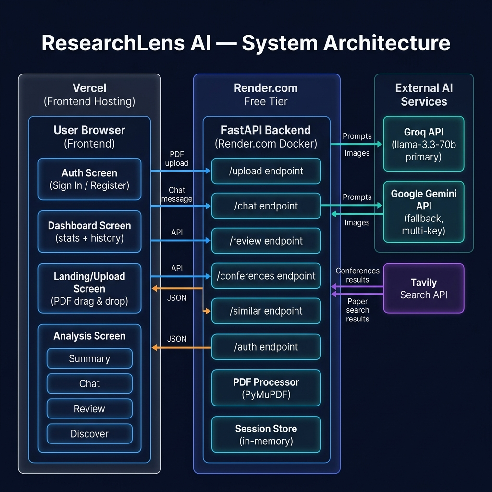
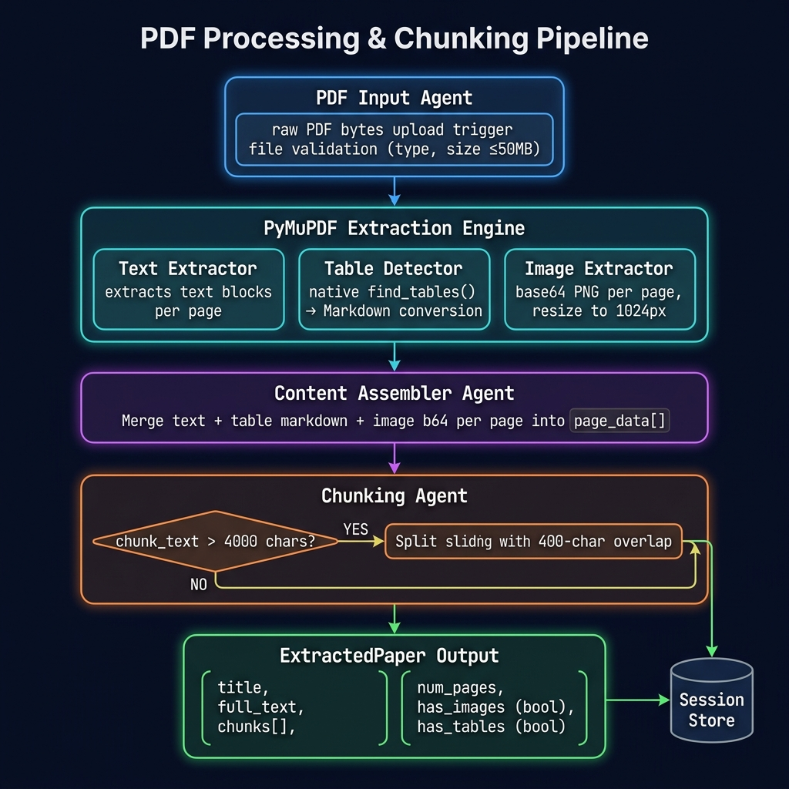
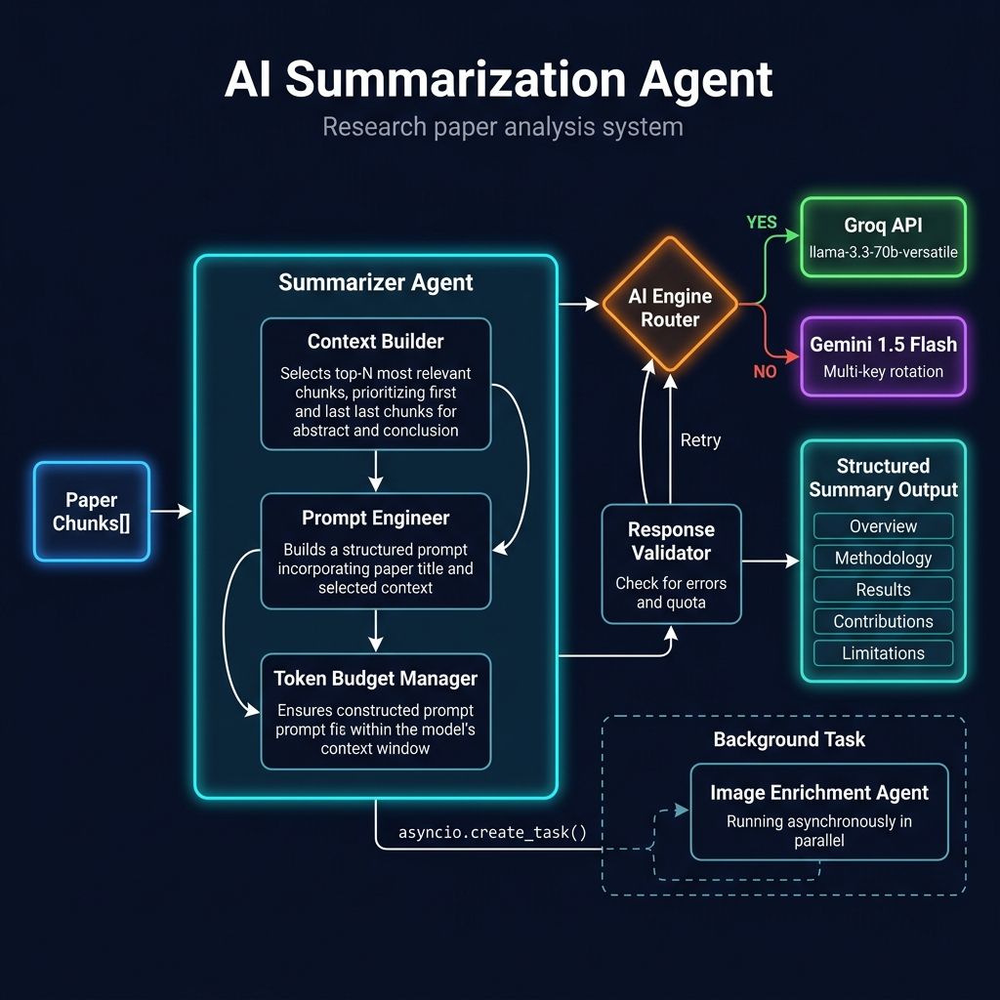
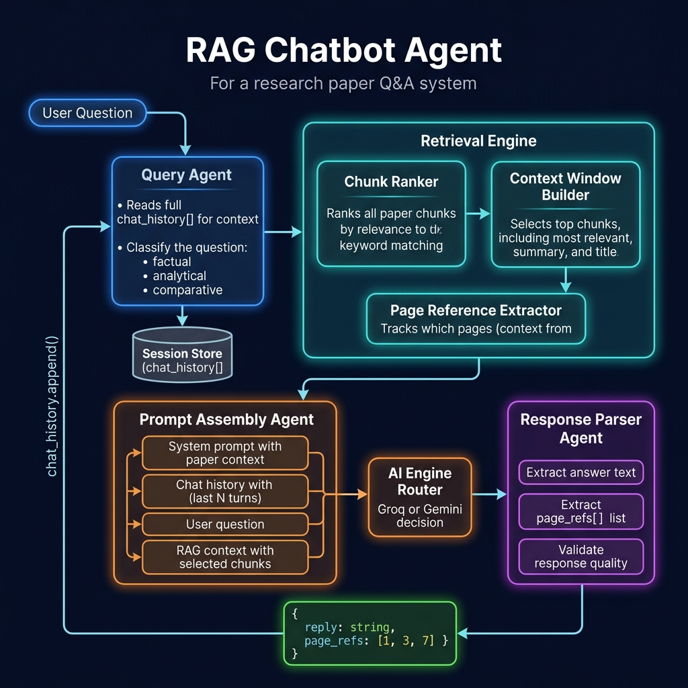
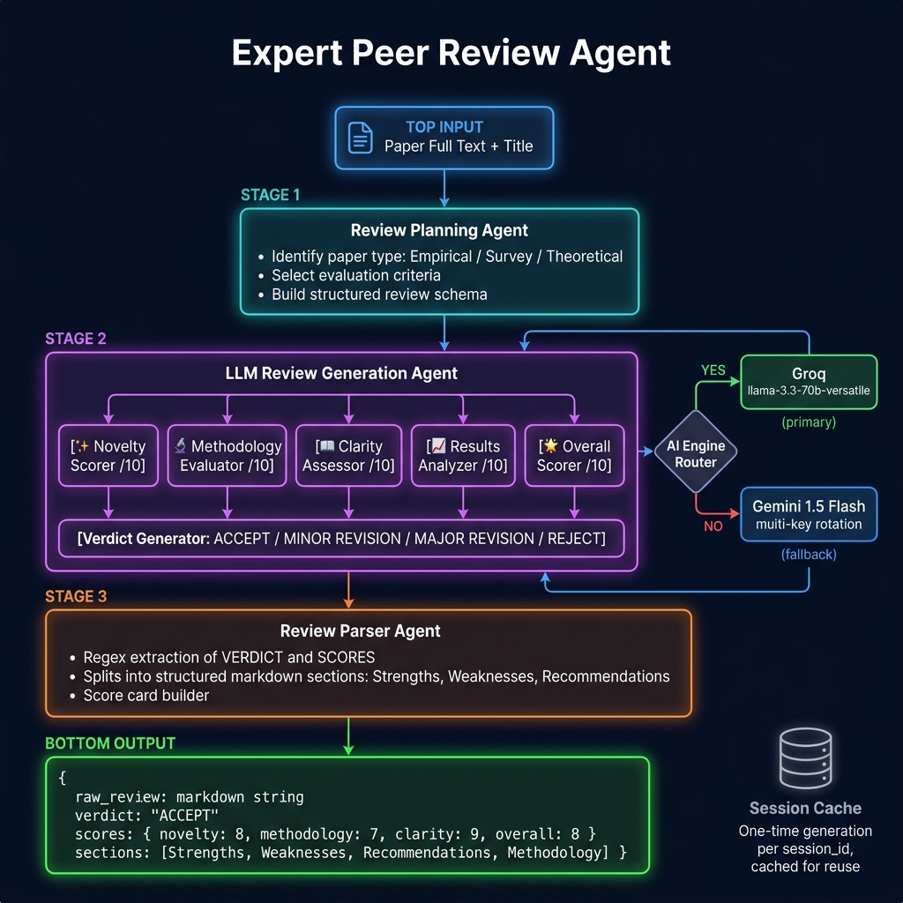
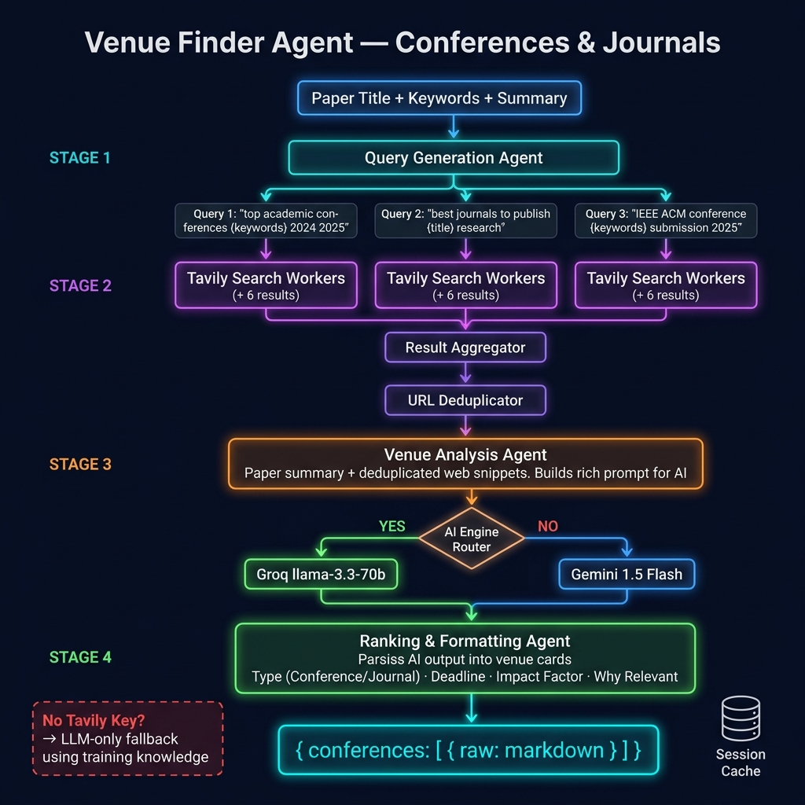
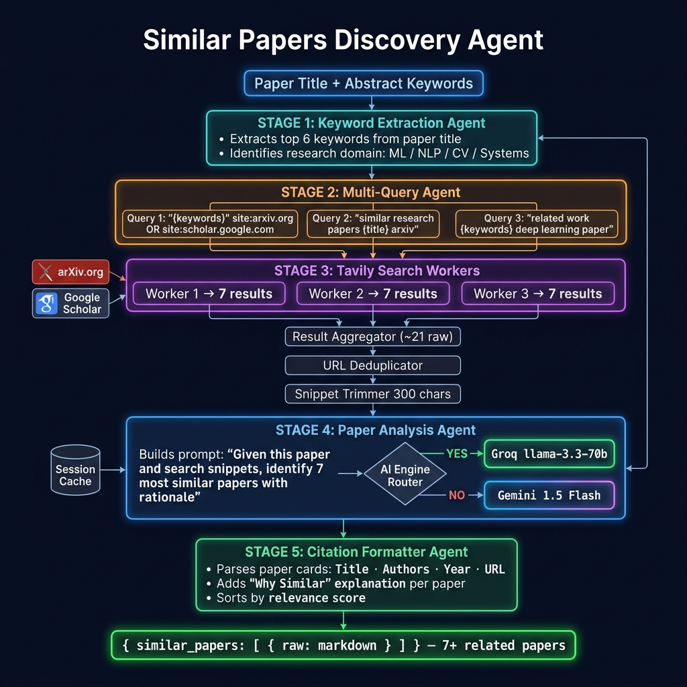
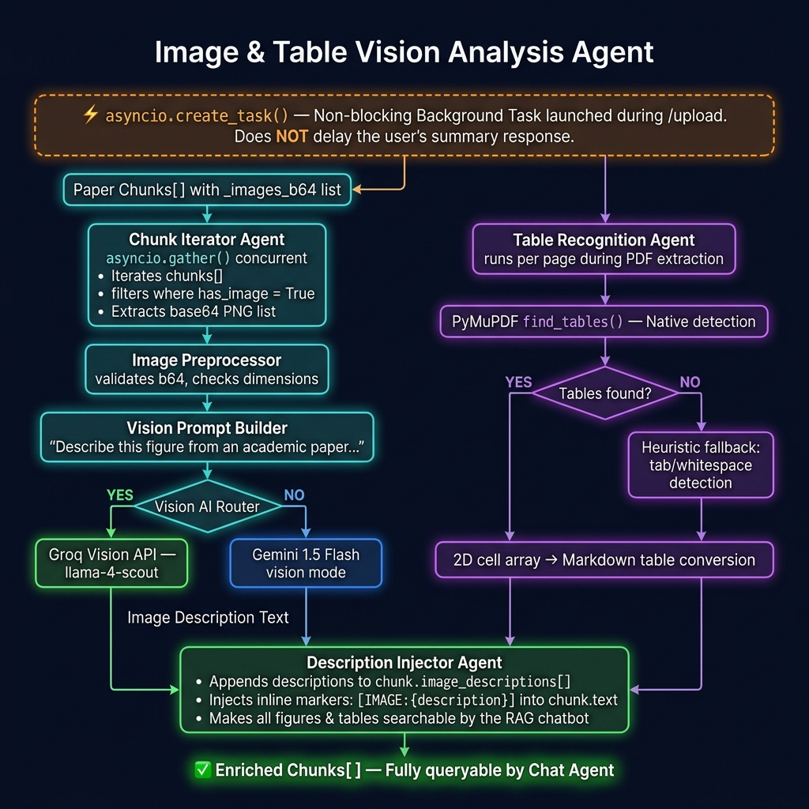

<div align="center">


<br/><br/>

# ⬡ ResearchLens AI

*Your AI-powered research analysis platform — upload any PDF and get instant summaries, expert peer reviews, publication venue suggestions, and related paper discovery.*

**[🚀 Live Demo](https://researchlens-backend.onrender.com)** · **[📖 API Docs](https://researchlens-backend.onrender.com/docs)**

</div>

---

## 📋 Table of Contents

- [Overview](#-overview)
- [Features](#-features)
- [System Architecture Overview](#-system-architecture-overview)
- [Feature Architecture Diagrams](#-feature-architecture-diagrams)
  - [1. PDF Processing & Chunking Pipeline](#1-pdf-processing--chunking-pipeline)
  - [2. AI Summarization Agent](#2-ai-summarization-agent)
  - [3. RAG Chatbot Agent](#3-rag-chatbot-agent)
  - [4. Expert Peer Review Agent](#4-expert-peer-review-agent)
  - [5. Venue Finder Agent](#5-venue-finder-agent)
  - [6. Similar Papers Discovery Agent](#6-similar-papers-discovery-agent)
  - [7. Image & Table Vision Agent](#7-image--table-vision-agent)
- [Tech Stack](#-tech-stack)
- [Project Structure](#-project-structure)
- [Quick Start](#-quick-start)
- [Environment Variables](#-environment-variables)
- [API Reference](#-api-reference)
- [Deployment](#-deployment)
- [Limitations & Known Issues](#-limitations--known-issues)

---

## 🌟 Overview

**ResearchLens AI** is a full-stack agentic AI assistant for academic researchers. You upload a research paper (PDF), and a chain of specialized AI agents instantly:

1. **Extracts** structured text, tables, and images using PyMuPDF
2. **Summarises** the paper in multi-section format via Groq LLaMA-3.3-70B (or Gemini 1.5 Flash fallback)
3. **Chats** with you about the paper using a RAG pipeline with page-level citations
4. **Reviews** the paper like an expert peer reviewer — verdict + 5 dimension scores
5. **Recommends** the best conferences & journals using live web search via Tavily
6. **Discovers** similar research papers from arXiv and beyond

---

## ✨ Features

| Feature | Description |
|---|---|
| 📄 **PDF Upload** | Drag-and-drop or click-to-upload, up to 50 MB |
| 🧠 **AI Summarisation** | Multi-section structured summary in seconds |
| 💬 **RAG Chatbot** | Ask anything about the paper; answers include page references |
| 📋 **Peer Review** | Structured review with verdict + 5 dimension scores |
| 🏛️ **Venue Finder** | Live-searched conferences & journals ranked by relevance |
| 🔗 **Similar Papers** | Related work from arXiv & Google Scholar |
| 🖼️ **Vision Analysis** | Figures and tables extracted and described by AI |
| 🔑 **Auth (Client-side)** | Sign in / Register — fully localStorage-based, no backend dependency |

---

## 🏗 System Architecture Overview



### High-Level Request Flow

```
User Browser (Vercel)
    │
    ├─ Auth ──────────────────────────────► localStorage only (no backend call)
    │
    ├─ POST /upload (PDF) ────────────────► FastAPI Backend (Render.com)
    ├─ POST /chat                                    │
    ├─ GET  /review/{id}                    ┌────────┴────────┐
    ├─ GET  /conferences/{id}               │  ai/router.py   │
    └─ GET  /similar/{id}                   └────────┬────────┘
                                                     │
                                         ┌───────────┼───────────┐
                                         ▼           ▼           ▼
                                    Groq API    Gemini API   Tavily API
                               llama-3.3-70b  1.5-flash    Web Search
                               (primary)      (fallback)
```

---

## 🤖 Feature Architecture Diagrams

---

### 1. PDF Processing & Chunking Pipeline

> **Triggered by:** `POST /upload` → `pdf_processor.py`



**Agent responsibilities:**

| Agent | Role |
|---|---|
| `PDF Input Agent` | Validates file type & size (≤ 50 MB), reads raw bytes |
| `Text Extractor` | Iterates page blocks, extracts plain text per page |
| `Table Detector` | Runs PyMuPDF `find_tables()` → converts 2D cells to Markdown; falls back to whitespace heuristic |
| `Image Extractor` | Extracts embedded images, resizes to ≤ 1024 px, encodes as base64 PNG |
| `Content Assembler` | Merges text + table markdown + image b64 per page into `page_data[]` |
| `Chunking Agent` | Sliding-window split at 4 000 chars with 400-char overlap; prefers paragraph/sentence boundaries |
| `Session Store` | Persists `ExtractedPaper` in memory (TTL 4 h), returns `session_id` |

---

### 2. AI Summarization Agent

> **Triggered by:** Immediately after `/upload`, blocking the response



**Agent responsibilities:**

| Agent | Role |
|---|---|
| `Context Builder` | Selects top chunks — always includes first + last (abstract & conclusion) |
| `Prompt Engineer` | Assembles structured prompt: title + context + output schema |
| `Token Budget Manager` | Trims context to fit within model's context window |
| `AI Engine Router` | Routes to Groq (primary) or Gemini (fallback) |
| `Response Validator` | Detects quota errors, triggers retry with next available key |
| `Image Enrichment Agent` | Runs **async** via `asyncio.create_task()` — does NOT block the summary response |

---

### 3. RAG Chatbot Agent

> **Triggered by:** `POST /chat`



**Agent responsibilities:**

| Agent | Role |
|---|---|
| `Query Agent` | Receives message + full `chat_history[]` from session |
| `Chunk Ranker` | Scores every chunk against the query using keyword overlap |
| `Context Window Builder` | Picks top-K chunks + paper summary + title |
| `Page Reference Extractor` | Records which pages the selected chunks come from |
| `Prompt Assembly Agent` | Builds multi-part prompt: system + context + history + question |
| `Response Parser` | Extracts answer text + `page_refs[]` from model output |
| `History Appender` | Appends `(user, assistant)` turn to `session.chat_history` |

---

### 4. Expert Peer Review Agent

> **Triggered by:** `GET /review/{session_id}` · **Cached** per session



**Agent responsibilities:**

| Agent | Role |
|---|---|
| `Review Planning Agent` | Identifies paper type (Empirical/Survey/Theoretical), selects evaluation criteria |
| `LLM Review Generation Agent` | Runs 5 dimension scorers: Novelty · Methodology · Clarity · Results · Overall |
| `Verdict Generator` | Produces final decision: ACCEPT / MINOR REVISION / MAJOR REVISION / REJECT |
| `AI Engine Router` | Routes to Groq (primary) or Gemini (fallback) |
| `Review Parser Agent` | Regex-extracts VERDICT + scores, splits into structured markdown sections |
| `Session Cache` | Stores result — generated only once per `session_id` |

---

### 5. Venue Finder Agent

> **Triggered by:** `GET /conferences/{session_id}` · **Cached** per session



**Agent responsibilities:**

| Agent | Role |
|---|---|
| `Query Generation Agent` | Generates 3 targeted search queries from paper title + keywords |
| `Tavily Search Workers` | 3 parallel workers, each fetching up to 6 results from the live web |
| `Result Aggregator` | Merges ~18 raw results, deduplicates by URL, trims snippets to 300 chars |
| `Venue Analysis Agent` | Builds rich prompt with paper summary + web context, calls AI engine |
| `AI Engine Router` | Routes to Groq (primary) or Gemini (fallback) |
| `Ranking & Formatting Agent` | Parses output into venue cards: Type · Deadline · Impact Factor · Why Relevant |
| `LLM-only fallback` | Used when no `TAVILY_API_KEY` is set — relies on model training knowledge |

---

### 6. Similar Papers Discovery Agent

> **Triggered by:** `GET /similar/{session_id}` · **Cached** per session



**Agent responsibilities:**

| Agent | Role |
|---|---|
| `Keyword Extraction Agent` | Extracts top 6 title keywords; identifies research domain |
| `Multi-Query Agent` | Generates 3 targeted queries: arXiv, broad arxiv, related-work style |
| `Tavily Search Workers` | 3 parallel workers × 7 results = ~21 raw results from arXiv + Scholar |
| `Result Aggregator` | Deduplicates by URL, trims snippets to 300 chars |
| `Paper Analysis Agent` | Builds prompt to identify 7 most similar papers with rationale |
| `Citation Formatter Agent` | Parses cards: Title · Authors · Year · URL · Why Similar |
| `Session Cache` | Stores result — generated only once per `session_id` |

---

### 7. Image & Table Vision Agent

> **Triggered by:** `asyncio.create_task()` immediately after `/upload` — **non-blocking**



**Agent responsibilities:**

| Agent | Role |
|---|---|
| `asyncio.create_task()` | Launches vision enrichment in background — does **not** block `/upload` response |
| `Chunk Iterator Agent` | Concurrently iterates chunks via `asyncio.gather()`, filters `has_image = True` |
| `Image Preprocessor` | Validates base64, checks dimensions, skips tiny images (< 50 px) |
| `Vision Prompt Builder` | Constructs multimodal prompt: "Describe this figure from an academic paper..." |
| `Vision AI Router` | Routes to Groq Vision (llama-4-scout) or Gemini 1.5 Flash vision mode |
| `Table Recognition Agent` | Runs `find_tables()` natively; falls back to whitespace heuristic per page |
| `Description Injector` | Appends AI descriptions to `chunk.image_descriptions[]` and inlines into `chunk.text` |

---

## 🛠 Tech Stack

### Backend

| Layer | Technology |
|---|---|
| Web framework | **FastAPI** 0.110+ (async) |
| PDF extraction | **PyMuPDF** (fitz) |
| Image processing | **Pillow** |
| AI — primary | **Groq API** (LLaMA-3.3-70B, free 30 RPM) |
| AI — fallback | **Google Gemini 1.5 Flash** (multi-key round-robin) |
| Web search | **Tavily API** |
| Container | **Docker** |
| Hosting | **Render.com** (free tier) |

### Frontend

| Layer | Technology |
|---|---|
| Structure | Vanilla HTML5 |
| Styling | Vanilla CSS3 (glassmorphism, CSS custom properties) |
| Logic | Vanilla JavaScript (ES2022, no framework) |
| Fonts | Google Fonts — Inter · Outfit · JetBrains Mono |
| Hosting | **Vercel** (also served from FastAPI) |

---

## 📂 Project Structure

```
BTP-2/
├── backend/
│   ├── main.py               # FastAPI app — all routes
│   ├── auth.py               # JWT auth endpoints (legacy)
│   ├── pdf_processor.py      # PDF → chunks (text + tables + images)
│   ├── session_store.py      # In-memory session store (TTL 4 h)
│   ├── search_service.py     # Tavily API web search
│   ├── requirements.txt      # Python dependencies
│   ├── Dockerfile            # Docker build
│   └── ai/
│       ├── config.py         # API key detection (Groq / Gemini)
│       ├── router.py         # Routes prompts to best engine
│       ├── engines/
│       │   ├── groq_engine.py    # Groq async client (vision + text)
│       │   └── gemini_engine.py  # Gemini async client (key rotation)
│       ├── tools/
│       │   ├── summarizer.py     # Summarization agent
│       │   ├── chatbot.py        # RAG chatbot agent
│       │   ├── reviewer.py       # Peer review agent
│       │   ├── conferences.py    # Venue finder agent
│       │   ├── similar_papers.py # Similar papers agent
│       │   ├── image_enricher.py # Vision AI agent
│       │   └── json_filter.py    # JSON post-processing
│       └── prompts/
│           └── __init__.py       # Centralised prompt templates
│
├── frontend/
│   ├── index.html            # Single-page app (4 screens)
│   ├── app.js                # Auth · Upload · Chat · Review · Discover
│   ├── style.css             # Dark theme · Glassmorphism · Animations
│   └── vercel.json           # Vercel routing config
│
├── docs/                     # Architecture diagrams
│   ├── architecture_overview.png
│   ├── arch_pdf_pipeline.png
│   ├── arch_summarizer.png
│   └── arch_rag_chatbot.png
├── render.yaml               # Render.com deployment spec
└── README.md
```

---

## 🚀 Quick Start

### Prerequisites
- Python 3.11+
- A **Groq API key** (free at [console.groq.com](https://console.groq.com)) **or** a **Gemini API key**

### 1 — Clone & configure

```bash
git clone https://github.com/Mrinmoy-1601/ResearchLensAI.git
cd ResearchLensAI
```

Create `.env` in the project root (see [Environment Variables](#-environment-variables) below).

### 2 — Install & run

```bash
cd backend
pip install -r requirements.txt
uvicorn main:app --reload --port 8000
```

Open **http://localhost:8000** — the frontend is served automatically.

---

## 🔑 Environment Variables

```env
# ── AI Engines (at least one required) ────────────────────────────
GROQ_API_KEY=gsk_...            # Free at console.groq.com (recommended)

GEMINI_API_KEY=AIza...          # Free at aistudio.google.com
GEMINI_API_KEY_2=AIza...        # Add more for higher throughput
GEMINI_API_KEY_3=AIza...

# ── Optional ───────────────────────────────────────────────────────
TAVILY_API_KEY=tvly-...         # Free at tavily.com — enables Venue Finder & Similar Papers
JWT_SECRET=your-secret-key      # Legacy backend auth (frontend uses client-side auth)
```

---

## 📡 API Reference

Base URL: `https://researchlens-backend.onrender.com`

| Method | Endpoint | Description |
|---|---|---|
| `POST` | `/upload` | Upload PDF → returns `session_id` + summary |
| `POST` | `/chat` | Send a question about the paper |
| `GET` | `/review/{id}` | Generate / retrieve peer review |
| `GET` | `/conferences/{id}` | Get venue recommendations |
| `GET` | `/similar/{id}` | Get similar papers |
| `GET` | `/health` | Liveness check |
| `GET` | `/docs` | Interactive Swagger UI |

### `POST /upload`
```json
// Response
{
  "session_id": "uuid-...",
  "title": "Attention Is All You Need",
  "num_pages": 15,
  "num_chunks": 23,
  "summary": "## Overview\n...",
  "has_images": true,
  "has_tables": false
}
```

### `POST /chat`
```json
// Request
{ "session_id": "uuid-...", "message": "What is the main contribution?" }

// Response
{ "reply": "The paper introduces...", "page_refs": [1, 3, 7] }
```

---

## ☁️ Deployment

### Backend — Render.com

```yaml
# render.yaml
services:
  - type: web
    name: researchlens-backend
    env: docker
    dockerContext: ./backend
    dockerfilePath: ./backend/Dockerfile
    plan: free
    autoDeploy: true
```

1. Push repo to GitHub
2. Render → **New Web Service** → connect repo (auto-detects `render.yaml`)
3. Add env vars under **Environment**
4. Deploy → live at `https://researchlens-backend.onrender.com`

### Frontend — Vercel

Set **Root Directory** to `frontend/`. No build step needed — pure static HTML/CSS/JS.

---

## ⚠️ Limitations & Known Issues

| Issue | Details |
|---|---|
| **Cold-start delay** | Render free tier sleeps after 15 min inactivity. First request may take 30–60 s. |
| **In-memory sessions** | Sessions lost on restart. Summaries restore from localStorage cache; Chat/Review/Discover require re-upload. |
| **Client-side auth** | Passwords stored with lightweight FNV hash in `localStorage`. Demo-grade only — not production-safe. |
| **Groq rate limits** | Free tier: 30 RPM / 14 400 req per day. Gemini fallback activates automatically. |
| **PDF size** | Max 50 MB. Papers > 200 pages may produce truncated summaries due to context limits. |

---

<div align="center">
  Made with ❤️ using FastAPI · Groq · Gemini · PyMuPDF · Tavily
</div>
